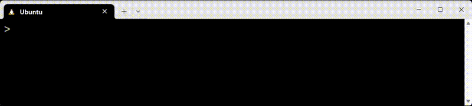

# rls

[English README](README_english.md) | [日本語 README](README.md)

[](https://github.com/zunyon/rls/actions/workflows/makefile.yml)

rls is a file-listing command-line tool designed with a different philosophy from ls.  
rls highlights the unique portion of each filename to make filename completion in the fish shell easier.

## Overview
rls displays filenames with the unique substring of each file highlighted.  
When rls output is used together with fish's filename completion, it can reduce the amount of typing required.

### Highlighting unique substrings
rls highlights only the characters required for fish to complete a filename.  
For example, after typing `emacs n.c` and pressing `TAB`, fish completes `countfunction.c`.  
The highlighted portion indicates the minimal input needed to match that file.  
In the rls.fish completion script, typing just `.f` can be sufficient to match.



### Column definition
With rls you can choose which columns are shown and their order with `-f`.  
See the `-f` help entry for available fields.

For example, `rls -fmogcdwPN /init` prints the columns mode, owner, group, count, date, week, PATH, NAME in that order:
```sh
-rwxrwxrwx root root 2,735,264 Aug  7 04:54 Thu /init
```

And `rls -fNtom /init` prints NAME, time, owner, mode in that order:
```sh
init 2025, 08/07 04:54:55 root -rwxrwxrwx
```

If you run `rls -fm,o,g,C,d,w,PN /init` you get CSV-like output (`,` as separator), differing from the first example by using commas and specifying `C`:
```sh
-rwxrwxrwx , root , root , 2735264 , Aug  7 04:54 , Thu , /init
```

## Other options
- `-b` highlights the unique substring starting from the filename beginning — useful for shell completion that prefers prefix matching.
- `-TB`, `-TE` and `-n` allow surrounding the unique substring with characters (for terminals that cannot show color) and disable color respectively.
- `-P` shows only files that contain a specified substring.

- Short-format output preserves layout under redirection: `rls -fNk` produces output comparable to ls when redirected.

- Performance tips:
  Determining unique substrings requires more memory and comparisons as the number of files grows, so both memory usage and computation time increase with directory size. As a result, the unique substring lengths may also increase. Use `-s` to skip lstat() calls (lstat() can be slow). Use `-n` to disable coloring (the unique substring computation is also costly).  
  - For colored listings, `rls -s` is fastest.  
  - For non-colored listings, `rls -sn` is fastest.

## Development / Supported environments
rls is built with make. The main source file is rls.c. Below is an example of installing rls to /usr/local/bin/:

```sh
git clone https://github.com/zunyon/rls.git
cd rls
make
cp rls /usr/local/bin/
```

The following are the development environments where make and rls were tested:

|       | Ubuntu | wsl      | Other  |
|-----:|:------:|:--------:|:------:|
| uname | 6.15.0 | 6.6.87.2 | 6.12.25 |
| gcc   | 14.3.0 | 11.4.0   | 10.2.1  |
| make  | 4.4.1  | 4.3      | 4.3     |
| fish  | 4.0.2  | 3.3.1    | 3.1.2   |

### Files other than rls.c
The repository contains rls.fish, countfunction.c, countfunction.h, and others.

- countfunction.c / countfunction.h  
  These wrap common functions. The wrappers mainly count operations, which is useful for profiling or experimenting with algorithms. There is also an alternate implementation of scandir() using opendir/readdir/closedir for portability; these files are used by targets such as `make debug` or `make count`.

- rls.fish  
  A fish completion script that goes into ~/.config/fish/completions/. It documents the main options.

### Terminal used for completion demo
The demo was recorded with:
- Windows Terminal using the "Tango Dark" color scheme
- Environment variable RLS_COLORS set to:
  base=37:normal=34:dir=36:fifo=33:socket=35:device=33:error=31:paint=32:normal=1:dir=1:socket=1:device=1:label=1:error=1:paint=1:reset=0

The color settings use 256-color SGR sequences (the implementation uses the 5-bit color spec; truecolor (2) is not implemented — see initColor()).

## How it works
rls highlights unique substrings in filenames. The process roughly consists of selecting candidates and then matching character-by-character:

- Candidate selection:
  - All files in the target directory are considered as candidates.
  - Files are grouped by filename and extension when appropriate.
- For all candidates:
  - Pattern matching starts from the first character.
  - Substrings that do not match any other candidate are treated as unique substrings.
- The unique substring is highlighted and printed.

When multiple unique substring candidates exist for a file, the shorter substring and the one closer to the filename start are preferred. If multiple unique substrings are present, only one is highlighted.

The program flow is roughly:

1. Data acquisition
   - Parse options:
     - Select which files to output
     - Choose which fields to show
   - Gather file metadata
2. Data processing
   - Format output fields
   - Determine highlighting:
     - Unique substrings (`-b`, `-e`, `-u`, etc.)
     - Specified substrings (`-p`)
3. Layout and sorting
   - Sort entries (rows)
   - Arrange columns (order)
   - Adjust output format
4. Output to terminal

## Notes for contributors / curious users
<details>
<summary>Design rationale and background</summary>

### Design rationale / background
Many file listing tools focus on file metadata. For filename completion, metadata alone is insufficient. rls computes a "difference" relative to other filenames in the same directory and visualizes that difference (unique substring). This "difference" is changeable (files added/removed or renamed) and is useful for completion, which is why rls highlights it.

### Value of color for fixed vs. variable information
Most colorized listings use color to represent fixed attributes (file type, extension, etc.). Fixed attributes are useful for distinguishing items, but their meaning can be learned over time and color can lose semantic value. Color can also add information without modifying the original data. rls uses color to show a dynamic property — the unique substring — which provides actionable information for completion.

</details>

<details>
<summary>About some surprising rls behaviors</summary>

### Behaviors that may seem surprising
Some rls behaviors can be unintuitive at first. Explanations follow.

- `-c` color config errors and redirection  
  When `-c` is used and there is a configuration error, the error message is not written to redirected output by default. For example, `rls -ck=31` prints a configuration error, but `rls -ck=31 > log` does not write that error into `log`. If you add `-always` (e.g. `rls -ck=31 -always > log`) then the error will be written to the redirected output.

  This happens because rls by default suppresses escape sequences when output is redirected; color handling (and thus validation of `-c`) is skipped on redirection. `-always` forces color handling and causes config validation to run.

- Filenames that make unique detection difficult and the `-e` option for grouping  
  rls can struggle when many files differ only by extension (e.g., many image/audio/video files or pairs like source and compiled files). In such cases rls rarely identifies unique substrings. The `-e` option groups files that share the same base name (ignoring extensions) and determines unique substrings per group; one file per group receives the highlight (paint color). Because a single completion cannot match multiple files, grouping makes the common base name the completion target.

- rls' unique substrings vs. fish completion targets  
  Sometimes rls does not highlight the substring you expect, but fish still completes a file. That difference arises from different heuristics: fish prefers matches that start earlier in the filename when characters are equal. For instance, with `Makefile` and `a.out`, typing `a` and pressing TAB favors `a.out` in fish. rls, which computes unique substrings differently, may not mark `a` as unique.

  Also, completion behavior depends on the command being completed: `cd` may exclude files that are otherwise suggested by rls since fish has specific completion rules. rls' highlights are command-agnostic.

- Escaping and character substitution for display  
  Some characters in a filename prevent shell completion unless they are escaped (` `, `(`, `-`, `&`, etc.). rls displays a `\` before such characters for clarity and to make typed completion work. Additionally, fish treats `-` and `_` similarly; for comfort rls displays `-` and `_` as equivalent and may substitute one for the other in the highlighted portion. The substituted characters are shown in the paint color. This behavior can be disabled with `-n`.

</details>

---

## License
[License: MIT](./LICENSE)

## Help
- Version 0.3.0 help: ./README_rls_v0.3.0.md  
- Version 0.4.0 (current) help: ./README_rls_current.md

## Changes since v0.3.0
- Added `-R`: display a numeric length in paint color.
- Added fields to `-f` (pipe `|`, comma `,`, `S`, `C`, `u`, `U`).
- Added `-w`: when using English display, do not abbreviate month/day names.
- Changed `-O` to `-S` to mean "do not sort".
- Added `-O` to hide directories.
- Moved the timing of initColor() invocation in main().
- Fixed `colorUsage()` processing.
- Fixed `printAggregate()` when displaycount is 0.
- Added `freeDENT()`.
