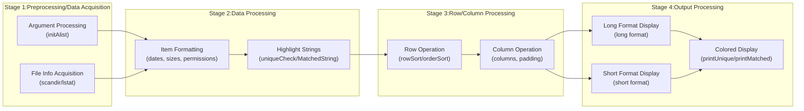

# rls

[English README](README_english.md) | [日本語 README](README.md) 

[](https://github.com/zunyon/rls/actions/workflows/makefile.yml)
[](https://deepwiki.com/zunyon/rls)

rls is a file listing command-line tool with a different design philosophy from ls.<br>
rls highlights the unique part of each filename for easier fish shell filename completion.


## Overview
`rls` is a program that lists files and directories, highlighting the unique substrings of their names.<br>
By combining the output of `rls` with `fish`'s filename completion feature, you can reduce keyboard input.


### Highlighting Unique Strings
`rls` displays a file list highlighting only the characters necessary for `fish` to complete the filename.<br>
For example, if you type `n.c` and press `TAB` like `emacs n.c`, `fish` will complete it to `countfunction.c`.
<br>
If you input the highlighted part, that file becomes the completion target.<br>
In the case of `rls.fish`, typing just `.f` makes it the completion target.


### Customizable Column Display
In `rls`, you can completely control the display items and their order with `-f`.

Executing `rls -fmogcdwPN /init` displays in the order of mode, owner, group, count, date, week, PATH, NAME.
```shell
-rwxrwxrwx root root 2,735,264 Aug  7 04:54 Thu /init
```

Executing `rls -fNtom /init` displays in the order of NAME, time, owner, mode.
```shell
init 2025, 08/07 04:54:55 root -rwxrwxrwx
```

Also, executing `rls -fm,o,g,C,d,w,PN /init` results in CSV format.<br>
```shell
-rwxrwxrwx , root , root , 2735264 , Aug  7 04:54 , Thu , /init
```

Other examples:
```shell
rls -fcn -Fcc /usr/             # Order by number of directory entries
rls -fCsn -Fss /tmp/            # Order by file size (largest first)
rls -fcNLE -Fee /mnt/           # Check for files with errors (-f needs items invoking lstat() like c, s, d, w, m)
rls -Fxss -fxsn ~/project/src   # File type (by extension), order by size
```
For item types, please check the help for `-f`.
<br>

## Other Distinctive Options
- `-p` highlights specified strings; all items displayed with `-f` are targets for highlighting.
- `-F` changes sort order; all items specified with `-f` are sort targets. Multiple sort conditions (1st, 2nd, 3rd...) can be specified.
- `-TB`, `-TE` and `-n` enclose unique strings with specified characters for unique string notation on terminals that cannot colorize.
- `-e` highlights unique strings for "groups" where multiple filenames differ only by extension, like elisp.
- `-R` displays string lengths of a specified number in paint color.
<br>


## Development Environment / System Requirements
`make` is used to compile `rls`. The only file required for compilation is `rls.c`.

```sh
# clone repository
git clone https://github.com/zunyon/rls.git

cd rls
make
cp rls /usr/local/bin/

# option
cp rls.fish ~/.config/fish/completions/

# run
rls             # Default details
rls -l          # Default details (Long format)
```

<details>
<summary> Development environment where make and rls operation were confirmed </summary>

`ubuntu-latest` and `macos-latest` are GitHub environments.
|     |Ubuntu|     wsl|  Other|ubuntu-latest| macos-latest|
  ---:|  ---:|    ---:|   ---:|         ---:|         ---:|
 uname|6.15.0|6.6.87.2|6.12.25|       6.14.0|Darwin 24.6.0|
   gcc|14.3.0|  11.4.0| 10.2.1|        13.30|       12.4.0|
  make| 4.4.1|     4.3|    4.3|          4.3|        4.4.1|
  fish| 4.0.2|   3.3.1|  3.1.2|            -|            -|

</details>


<details>
<summary> About files other than rls.c </summary>

### About files other than `rls.c`
Files such as rls.fish, countfunction.c, countfunction.h are included.

- countfuncion.c, countfunction.h
  - Wrapper functions for standard functions<br>
    Wrapper functions mostly just count, so they serve as indicators during profiling or when trying algorithm implementations.<br>
    Also, since there is an alternative implementation of scandir() using opendir/readdir/closedir, it might be useful for other OSs or development environments.<br>
    Used in `make debug` and `make count`.
- rls.fish
  - .fish file for fish<br>
    Stored in ~/.config/fish/completions/. Major options are described.
- Makefile
  - MD5 message digest<br>
    Running `make md5` allows `5` to be used with `-f`.
</details>


### Completion Example Terminal Environment
The terminal environment mentioned above is as follows:
- `Windows Terminal` using `Tango Dark` color scheme.
- `RLS_COLORS` environment variable set to `base=37:normal=34:dir=36:fifo=33:socket=35:device=33:error=31:paint=32:normal=1:dir=1:socket=1:device=1:label=1:error=1:paint=1:reset=0`
<br>

Color settings are the same as default colors, with emphasis (bright colors) set from the latter `normal=1`.<br>
`rls` color specification implementation is 256 colors. (Fixed at 5, true color (2) implementation is not done. See `initColor()`)<br>
Among them, since SGR (Select Graphic Rendition) parts are specified, using color schemes like `Solarized Dark` will result in display colors different from `Tango Dark`.
<br>


## Operating Principle
`rls` highlights and displays unique strings.<br>
The decision of unique strings is done character by character after selecting candidates.

- Selection of "Candidates"
  - All files in the specified directory become "candidates".
  - Groups are determined by filename and extension, becoming "candidates".
- Targeting all "Candidates"
  - Pattern matching from the 1st character of the filename.
  - Strings that **did not** match are determined as unique strings.
- Highlight and display

If there are multiple unique string candidates in a filename, the candidate with "fewer characters" or "closer to the beginning of the filename" is prioritized.<br>
Even if multiple unique strings are included, only one is highlighted.
<br>

The program is roughly divided into steps as follows:



## To those interested in rls
<details>
<summary> Design Philosophy / Background </summary>

### Design Philosophy / Background
There are many programs that display file lists, and those programs handle information about the files themselves.<br>
Considering filename completion, just the file information itself is not enough.<br>
`rls` calculates "differential" information with other filenames in the directory in addition to the file information itself.<br>
"Differential" information is "variable" information that changes with the addition/deletion of files or changes in filenames, and is useful for filename completion.<br>
Since I didn't see any program visualizing this "differential" information, `rls` highlights it.<br>
In `rls`, this "differential" information is called a unique string.


### About Fixed Information and the Value of Color
Generally, there are many programs that colorize file information, but "color" is mainly used to indicate "fixed" information. The purpose of representing fixed information with color is often "distinction" or "attention". To "distinguish" information, "attributes themselves" are colored, or to draw "attention" to information, "places (positions)" are colored.<br>
For example, color-coding by file attributes (mode or extension), or color-coding of fixed output formats and layouts.<br>
Since much file information is "fixed" information that does not change itself, the meaning of "color" used for "distinction" or "attention" is lost as users get used to it (memorizing it through repeated use or usage time). (Of course, there are situations where you want to "distinguish" or pay "attention" to fixed information as needed.)
<br><br>
"Color" can add new, different information without changing (adding, modifying, deleting) the amount of information of the original information displayed on the screen.
Therefore, it cannot be said that using "color" for the purpose of "distinguishing" or drawing "attention" to information that does not involve change is useful.<br>
In `rls`, one of the "variable" pieces of information that users were processing in their heads is displayed in "color".
<br><br>
</details>


<details>
<summary> About rls behavior that is strange if you don't know </summary>

### About rls behavior that is strange if you don't know
When using `rls`, you may think "??" about its behavior.
I will explain such behavior of `rls` and its judgment criteria.

- `rls` `-c` option setting error and redirection<br>
  About behavior when redirecting `-c` setting errors.<br>
  For example, `rls -ck=31` displays a setting error message when executed, but executing `rls -ck=31 > log` does not record the setting error in the `log` file.<br>
  Executing like `rls -ck=31 -always > log` with `-always` added records the setting error in the `log` file.
  <br><br>
  The reason is that `rls` default settings do not output escape sequences during redirection.<br>
  During redirection, the `-c` function itself (including evaluation of options inside) is skipped, so no setting error occurs.
  It means `-ck=31` is skipped and `rls` is executed.<br>
  By specifying `-always`, evaluation of `-c` options is performed, and error content comes to be redirected.
  <br><br>

- Filenames that are difficult to judge as unique strings, and `-e` option for "groups"<br>
  There are filenames that `rls` is not good at judging as unique strings.<br>
  If multiple files differing only in extension exist in the same directory, `rls` rarely judges them as unique strings.<br>
  For example, this applies when files of different formats like elisp files, image/video/audio files exist.<br>
  For directories storing elisp files, specifying `-e` makes it easier for unique strings to be displayed.
  <br><br>
  With the `-e` option, these multiple files are considered a "group" of the same name, and unique strings are judged.<br>
  The result highlights the unique string of one file in the "group".<br>
  Since one completion function cannot complete two or more filenames, filenames up to the "group" excluding the extension become completion targets.<br>
  "Groups" are displayed in paint text color.
  <br><br>

- `rls` unique string candidates and `fish` filename completion targets<br>
  When you feel "Huh? Isn't this the unique string?", that might be a better condition unique string.<br>
  Actually, even unique strings that `rls` does not highlight, there are strings that `fish` considers as completion targets.<br>
  You can check if it is a unique string with `-pxxx -r` etc.
  <br><br>
  This occurs because `rls` colorization criteria and `fish` file completion criteria are different.<br>
  For example, in `fish`, if the same characters are used, files used at the beginning of the filename are prioritized for completion.
  If there are two files M<span style="color:#729fcf;">a</span>kefile and <span style="color:#729fcf;">a</span>.out, if you type `a` and press `TAB`, `a.out` is prioritized for completion.<br>
  Also, even if file/directory names contain the same string, if the command is `cd`, files are not completion targets.<br>
  This is very rational, but it is the result of setting processing for `cd` in `fish` in advance, and executing another command that does the same `change directory` will not produce the same effect.<br>
  Since `rls` judges unique strings from filenames, `a` is not judged as a unique string in the first place, and unique strings do not depend on the command used. Etc.
  <br><br>

- About escape notation and character replacement display<br>
  There are unique strings where `fish` completion does not work as is, even if it is part of the filename.<br>
  For example, characters that have other meanings in the command line like ` ` (half-width space), `(`, `-`, `&`.<br>
  In `rls`, an escape character `\` is displayed before the above characters.
  By inputting from `\` when inputting the filename, completion becomes effective.
  <br><br>
  Also, since `-` and `_` are treated equally in `fish` filename completion function, `rls` displays `-` and `_` by replacing them with each other.<br>
  Replacement to `-` and `_` is judged dynamically.<br>
  Key input takes effort in the order of `complete in 1 key '-'` < `press 2 keys simultaneously '_'` < `press 2 keys sequentially "\-"`, and comparing `-` and `_`, it is `-` < `_`, but if `-` is at the beginning of a unique string, an escape character `\` is required, becoming `_` < `\-`, so it is better to replace with `_`.<br>
  Replacement display characters are displayed in paint text color.
  Also, this replacement display is disabled with `-n`.
</details>


<details>
<summary> To shorten rls execution time even a little </summary>

### To shorten rls execution time even a little
If there are many files, the time until display will be longer.
Naturally, unique strings will also be longer.<br>

If there are many files, the information to acquire also increases, and the number of comparisons to judge unique strings also increases.
Since these codes take particular time, try to avoid them.
- `-s` : stops lstat(). Yes. lstat() is slow.
- `-n` : stops highlighting. Unique string judgment is also slow.
- `-fn`: stops short format layout calculation. Layout calculation is slow.

|Command     |lstat()|Highlight|Layout         |Remark                                      |
 :---        |:---   |:---     |:---           |:---                                      |
 `rls -l`    |ON     |ON       |**Long Format**|Many information displayed. Output is slow.|
 `rls -s`    |**OFF**|ON       |Short Format   |Fastest if listing with highlights.       |
 `rls -sn`   |**OFF**|**OFF**  |Short Format   |Fastest if listing with Short format.     |
 `rls -fn -n`|**OFF**|**OFF**  |**Long Format**|Only list of filenames is output. Fastest among `rls` displays.|

</details>


---

## License
[License: MIT](./LICENSE)


## Help
- [Version 0.4.0 current](./README_rls_current.md) Help
- [Version 0.3.0](./README_rls_v0.3.0.md) Help
<br><br>


## Changes from v0.3.0
- add Added `-R`, display string length of specified number in paint color
- add Added items to `-f` (`|`, `,`, `S`, `C`, `u`, `U`, `x`, `X`, `I`)
- add Added `-w`, display month, day of week without abbreviation in English notation
- chg Changed `-O` to `-S`, do not sort
- add Added `-O`, hide directories
- chg Changed timing of initColor() in `main()`
- chg Fixed processing of `colorUsage()`
- fix Fixed processing when displaycount is 0 in `printAggregate()`
- add Added `-x`, extension summary display
- add Support for OpenMP
- del Abolished `-m`, `-z`, `-N` (Replaced by `-F`)
- add Added `-F`, sort by item (most items of `-f`, `p` as `n`, ignore `|`, `,`)
- chg Changed padding of `printLong()`

---

*Translated by Antigravity on 2026/01/31*
