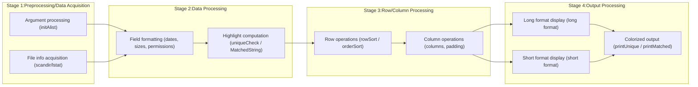

# rls

[English README](README_english.md) | [日本語 README](README.md) 

[](https://github.com/zunyon/rls/actions/workflows/makefile.yml)
[](https://deepwiki.com/zunyon/rls)

rls is a file listing command-line tool with a different design philosophy from ls.<br>
rls highlights the unique part of each filename for easier fish shell filename completion.


## Overview
`rls` is a program that lists files and directories, highlighting the unique substrings of their names.<br>
By combining the output of `rls` with `fish`'s filename completion feature, you can reduce keyboard input.


### Highlighting Unique Strings

# rls

[English README](README_english.md) | [日本語 README](README.md)

[](https://github.com/zunyon/rls/actions/workflows/makefile.yml)
[](https://deepwiki.com/zunyon/rls)

`rls` is a file-listing command-line utility whose design philosophy differs from `ls`.
It highlights the minimal unique substring of each filename to make filename completion
in the `fish` shell easier.

## Overview
`rls` lists files and directories while highlighting the substring of each name that is unique
within its candidate set. Using `rls` together with `fish`'s filename completion reduces the amount
of typing required.

### Highlighting unique substrings
`rls` highlights only the characters necessary for `fish` to complete a filename.
For example, typing `n.c` and pressing `TAB` (e.g. `emacs n.c` then `TAB`) may complete to
`countfunction.c` when the highlighted substring matches.


If you type the highlighted substring, that file becomes the completion target. For the
provided `rls.fish` completion script, typing just `.f` may be sufficient to match certain files.

### Customizable column display
You can fully control which fields are shown and their order using `-f`.

Examples:

```sh
rls -fmogcdwPN /init   # mode owner group count date week PATH NAME
```

Output example:

```sh
-rwxrwxrwx root root 2,735,264 Aug  7 04:54 Thu /init
```

```sh
rls -fNtom /init       # NAME time owner mode
```

Output example:

```sh
init 2025, 08/07 04:54:55 root -rwxrwxrwx
```

```sh
rls -fm,o,g,C,d,w,PN /init  # CSV-like output
```

Output example:

```sh
-rwxrwxrwx , root , root , 2735264 , Aug  7 04:54 , Thu , /init
```

Other usage examples:

```sh
rls -o -fcn -Fcc /usr/              # sort by directory entry count
rls -fCsn -Fss /tmp/                # sort by file size (largest first)
rls -fcNLE -Fee /mnt/               # check files with errors (-f requires fields invoking lstat()
                                     # such as c, s, d, w, m)
rls -Fxss -fxsn ~/project/src       # file type by extension, then by size
rls -fmogcdjNKLE -jxSRC=c,h -PSRC   # show files in directory whose extension is c or h
```

See the help for `-f` for the full list of available fields.

## Notable options

- `-p` : highlight a specified substring; fields selected with `-f` become highlight targets
- `-F` : change sort order; fields specified with `-f` are sortable; multiple sort keys are supported
- `-nn`: show unique substring enclosed in characters (for terminals without color support)
- `-e` : treat files that differ only by extension as a "group" and compute unique substrings per group

Additional: `-j` supports classification/labeling (used together with `-fj`):

- Group different file kinds into a single classification (e.g., `png,jpg,gif` as images)
- Example: `xImage=png,jpg,gif:xMovie=mp4,mov,avi:xAudio=mp3,wav`
  - If `-f`'s extension field `x` matches `png|jpg|gif`, display `Image`.
  - If it matches `mp4|mov|avi`, display `Movie`.
  - If it matches `mp3|wav`, display `Audio`.
- To uniquely identify a single file, specify its inode with `i` or `I` (e.g. `INo Delete=123456789`).

## Development / Runtime environment

`make` is used to build `rls`. Only `rls.c` is required to compile.

```sh
# clone repository
git clone https://github.com/zunyon/rls.git

cd rls
make
cp rls /usr/local/bin/

# (optional) install fish completion
cp rls.fish ~/.config/fish/completions/

# run
rls
rls -l
```

<details>
<summary>Development environments where `make` and `rls` were tested</summary>

These were tested on GitHub's `ubuntu-latest` and `macos-latest` runners.

|            | Ubuntu  | wsl      | Other    | ubuntu-latest | macos-latest |
|:----------:|:-------:|:--------:|:--------:|:-------------:|:------------:|
| uname      | 6.15.0  | 6.6.87.2 | 6.12.25  | 6.14.0        | Darwin 24.6.0|
| gcc        | 14.3.0  | 11.4.0   | 10.2.1   | 13.30         | 12.4.0       |
| make       | 4.4.1   | 4.3      | 4.3      | 4.3           | 4.4.1        |
| fish       | 4.0.2   | 3.3.1    | 3.1.2    | -             | -            |

</details>

<details>
<summary>Files other than `rls.c`</summary>

- `countfunction.c`, `countfunction.h`
  - Wrapper functions around standard calls. They mainly count and are useful
    for profiling or testing algorithm implementations. They also include an
    alternative to `scandir()` implemented using `opendir`/`readdir`/`closedir`.
    These are used by `make debug` and `make count`.

- `rls.fish`
  - Completion script for `fish` (install to `~/.config/fish/completions/`).

- `Makefile`
  - Contains a target that builds an MD5 message digest; running `make md5` enables
    the `5` field for `-f`.

- `showEscapeList.c`
  - Displays Control Sequence Introducer examples (originally the `-256` option).

</details>

### Example terminal environment used for completion demos

- Windows Terminal using the `Tango Dark` color scheme
- `RLS_COLORS` set to `base=37:normal=34:dir=36:fifo=33:socket=35:device=33:error=31:paint=32:normal=1:dir=1:socket=1:device=1:label=1:error=1:paint=1:reset=0`

`rls` uses a 256-color implementation for color selection (fixed at mode 5; truecolor mode 2 is not implemented — see `initColor()`).
Because SGR (Select Graphic Rendition) parameters are used, colors may differ when using other themes such as `Solarized Dark`.

## How it works

`rls` highlights unique substrings computed from the set of candidate entries. The algorithm is roughly:

- Candidate selection
  - All files in the specified directory are considered candidates.
  - Groups are formed from filename and extension when appropriate.
- For all candidates
  - Perform pattern matching starting from the first character of filenames.
  - The substring that does not match other candidates is considered the unique substring.
- Highlight and display the result.

If multiple unique-substring candidates exist for a filename, preference is given to the shorter substring
and the one that appears earlier in the filename. Only one substring is highlighted per entry.

The program's stages:



## Design rationale and background

There are many file-listing programs; they typically present properties of individual files.
For filename completion, however, information derived from differences between filenames in a directory
is useful. `rls` computes these "differential" properties (which change as files are added/removed or renamed)
and visualizes them as unique substrings.

### Fixed information vs. color's value

Many programs use color to indicate fixed attributes (mode, extension, etc.). Over time users learn these
color mappings, and their effectiveness for "distinction" or "attention" can diminish. Color can instead
be used to add new, dynamic information without altering the base data. `rls` uses color to surface one
piece of variable information — the unique substring — that aids completion.

## Behaviors that may seem odd at first

### `-c` option errors and redirection

When redirecting output, `rls` may skip evaluating `-c` (color) settings by default, so configuration errors
from `-c` are not written into redirected output. For example, `rls -ck=31` prints an error to the terminal,
but `rls -ck=31 > log` will not record that error into `log`. Adding `-always` forces `-c` evaluation even
during redirection, so errors are redirected as well.

### Filenames that are hard to treat as unique, and the `-e` option for groups

If a directory contains files that differ only by extension (e.g., `file.el`, `file.txt`) `rls` will often
not identify unique substrings for each file. The `-e` option groups such files and computes a single
unique substring per group (useful for elisp, images, audio/video collections). Grouped entries are shown
using the `paint` color.

### `rls` unique substrings vs. `fish` completion

`rls`'s highlighted substring may differ from what `fish` chooses to complete because their selection
criteria differ. For example, `fish` tends to prefer filenames that begin with the typed characters.
Use `-pxxx -r` to inspect candidate unique substrings.

Also, `fish` treats `-` and `_` equivalently when matching; `rls` may display replacements dynamically
to make typing easier.

### Escape notation and character replacement

Some characters in filenames (space, `(`, `-`, `&`, etc.) need escaping for shell completion. `rls`
displays a leading backslash `\` before such characters so typing from the backslash makes completion work.

Because `fish` treats `-` and `_` as equivalent, `rls` may substitute one for the other when helpful. The
displayed replacement is shown with the `paint` color. This substitution is disabled with `-n`.

## Performance hints

If a directory contains many files, computation and display time increases. To speed up output:

- `-s` disables `lstat()` calls (fastest highlighted short listing)
- `-n` disables highlighting (fast when only filenames are needed)
- `-fn -n` is the fastest minimal long-format listing (only filenames)

Summary table:

| Command       | lstat() | Highlight | Layout       | Note |
|:-------------:|:-------:|:---------:|:------------:|:-----|
| `rls -l`      | ON      | ON        | Long format  | Detailed, slower output |
| `rls -s`      | OFF     | ON        | Short format | Fast for highlighted listings |
| `rls -sn`     | OFF     | OFF       | Short format | Fastest short listing |
| `rls -fn -n`  | OFF     | OFF       | Long format  | Minimal filename-only long listing |

---

## License
[License: MIT](./LICENSE)

## Help

- [Version 0.4.0 current](./README_rls_current.md)
- [Version 0.3.0](./README_rls_v0.3.0.md)

## Changes since v0.3.0

- add `-R`: display specified string length in `paint` color
- add new `-f` items: `|`, `,`, `S`, `C`, `u`, `U`, `x`, `X`, `I`, `D`, `W`, `j`
- add changed meaning for `-fp` path
- add `-fDW`: in English mode show month, day-of-week without abbreviation
- chg changed `-O` to `-S` (no sort)
- add `-O`: hide directories
- chg moved `initColor()` timing in `main()`
- chg fixed processing in `colorUsage()`
- fix fixed `printAggregate()` when `displaycount` is 0
- add OpenMP support
- del removed `-m`, `-z`, `-N` (replaced by `-F`)
- add `-F`: per-field sorting (most `-f` items; `p` treated as `n`; `|` and `,` ignored)
- chg changed padding in `printLong()`
- del removed `-TB`, `-TE` (integrated into `-nn`; enclosure fixed to `[` and `]`)
- del removed `-256`
- chg added extension aggregation display to `-r`
- add `-j`: classification for `-fj` and related usages

---

Translator: GitHub Copilot
Translation date: 2026-02-15
Note: This is an English translation of `README.md` intended to follow the original Japanese
content closely. If you find any literal or contextual issues, I will correct them.
