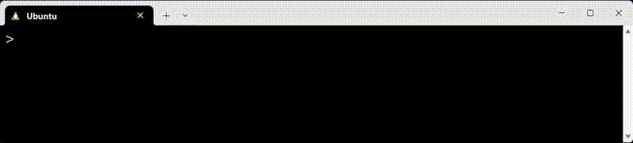
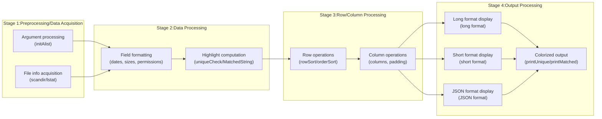

# rls

[English README](README_english.md) | [日本語 README](README.md) 

[](https://github.com/zunyon/rls/actions/workflows/makefile.yml)
[](https://deepwiki.com/zunyon/rls)

rls is a file listing command-line tool with a different design philosophy from ls.<br>
rls highlights the unique part of each filename for easier fish shell filename completion.


## Overview
`rls` is a program that lists files and directories, highlighting the unique substrings of their names.<br>
By combining the output of `rls` with `fish`'s filename completion feature, you can reduce keyboard input.


### Highlighting Unique Strings
`rls` highlights only the characters necessary for `fish` to complete a filename.<br>
For example, typing `n.c` and pressing `TAB` (e.g. `emacs n.c` then `TAB`) may complete to `countfunction.c` when the highlighted substring matches.


If you type the highlighted substring, that file becomes the completion target. For the provided `rls.fish` completion script, typing just `.f` may be sufficient to match certain files.


### Customizable column display
You can fully control which fields are shown and their order using `-f`.

Examples:

`rls -fmogcdwPN /init` displays mode owner group count date week PATH NAME in that order.

```sh
-rwxrwxrwx root root 2,735,264 Aug  7 04:54 Thu /init
```

`rls -fNtom /init` displays NAME time owner mode in that order.

```sh
init 2025, 08/07 04:54:55 root -rwxrwxrwx
```

Also, `rls -fm,o,g,C,d,w,PN /init` produces CSV-like output.

```sh
-rwxrwxrwx , root , root , 2735264 , Aug  7 04:54 , Thu , /init
```

Other usage examples:

```sh
rls -o -fcn -Fcc /usr/              # sort by directory entry count
rls -fCsn -Fss /tmp/                # sort by file size (largest first)
rls -fcNLE -Fee /mnt/               # check files with errors (-f requires fields invoking lstat() such as c, s, d, w, m)
rls -Fxss -fxsn ~/project/src       # file type by extension, then by size
rls -fmogcdjNKLE -JxSRC=c,h -PSRC   # show files in directory whose extension is c or h
find *.c -print | rls -- -alr       # apply -alr to find results
```

See the help for `-f` for the full list of available fields.


## Notable options

- `-p`: highlight a specified substring; fields selected with `-f` become highlight targets
- `-F`: change sort order; fields specified with `-f` are sortable; multiple sort keys are supported
- `-nn`: show unique substring enclosed in characters (for terminals without color support)
- `-e`: treat files that differ only by extension as a "group" and compute unique substrings per group
- `-J`: supports classification/labeling (used together with `-fj`):
  - Group different file kinds into a single classification (e.g., `png,jpg,gif` as images)
  - Example: `xImage=png,jpg,gif:xMovie=mp4,mov,avi:xAudio=mp3,wav`
    - If `-f`'s extension field `x` matches `png|jpg|gif`, display `Image`.
    - If it matches `mp4|mov|avi`, display `Movie`.
    - If it matches `mp3|wav`, display `Audio`.
  - To uniquely identify a single file, specify its inode with `i` or `I` (e.g. `INo Delete=123456789`).


## Development / Runtime environment

`make` is used to build `rls`. Only `rls.c` is required to compile.

```sh
# clone repository
git clone https://github.com/zunyon/rls.git

cd rls
make
cp rls /usr/local/bin/

# (optional) install fish completion
cp rls.fish ~/.config/fish/completions/

# run
rls             # Default details
rls -l          # Default details (Long format)
```

<details>
<summary> Development environments where `make` and `rls` were tested </summary>

`ubuntu-latest` and `macos-latest` are GitHub environments.

|     |Ubuntu|     wsl|  Other|ubuntu-latest| macos-latest|
  ---:|  ---:|    ---:|   ---:|         ---:|         ---:|
 uname|6.15.0|6.6.87.2|6.12.25|       6.14.0|Darwin 24.6.0|
   gcc|14.3.0|  11.4.0| 10.2.1|        13.30|       12.4.0|
  make| 4.4.1|     4.3|    4.3|          4.3|        4.4.1|
  fish| 4.0.2|   3.3.1|  3.1.2|            -|            -|
</details>


<details>
<summary> Files other than `rls.c` </summary>

### Files other than `rls.c`

rls.fish, countfunction.c, countfunction.h, etc. are included.

- countfunction.c, countfunction.h
  - Wrapper functions for standard functions<br>
    Wrapper functions mainly count, useful for profiling or testing algorithm implementations.<br>
    Also includes an alternative implementation of scandir() using opendir/readdir/closedir, useful for other OS or development environments.<br>
    Used by `make debug` or `make count`.

- rls.fish
  - .fish file for fish<br>
    Place in ~/.config/fish/completions/. Main options are listed.

- Makefile
  - MD5 message digest<br>
    `make md5` enables `5` for `-f`.
  - git<br>
    `make git` enables `6` for `-f`.

- showEscapeList.c
  - Control Sequence Introducer display<br>
    Former `-256` option. Compile with cc showEscapeList.c.

</details>


### Terminal environment for completion examples

The above terminal environment is as follows.

- Use `Tango Dark` color scheme in `Windows Terminal`
- Set `RLS_COLORS` environment variable to `base=37:normal=34:dir=36:fifo=33:socket=35:device=33:error=31:paint=32:normal=1:dir=1:socket=1:device=1:label=1:error=1:paint=1:reset=0`

<br>

The color settings are the same as default colors, with emphasis (bright colors) set after `normal=1`.<br>
`rls`'s color specification implementation is 256 colors. (Fixed at 5, true color (2) is not implemented. See `initColor()`)<br>
Among them, SGR (Select Graphic Rendition) is specified, so with color schemes like `Solarized Dark`, colors may differ from `Tango Dark`.

<br>


## How it works

`rls` highlights unique strings computed from the set of candidate entries. The algorithm is roughly:

- Candidate selection
  - All files in the specified directory are candidates
  - Groups are formed from filename and extension

- For all candidates
  - Pattern matching starting from the first character of filenames
  - The substring that does not match other candidates is considered the unique substring

- Highlight and display

If multiple unique substring candidates exist for a filename, preference is given to the shorter substring and the one that appears earlier in the filename.<br>
Only one substring is highlighted per entry.

<br>

The program is roughly divided into the following stages.


```mermaid
	flowchart LR
	subgraph Stage 1:Preprocessing/Data Acquisition
		A["Argument processing<br>(initAlist)"]
		B["File info acquisition<br>(scandir/lstat)"]
	end
	A & B --> D

	subgraph Stage 2:Data Processing
		D["Field formatting<br>(dates, sizes, permissions)"]
		E["Highlight computation<br>(uniqueCheck/MatchedString)"]
	end
	D --> E
	E --> G

	subgraph Stage 3:Row/Column Processing
		G["Row operations<br>(rowSort/orderSort)"] --> H["Column operations<br>(columns, padding)"]
	end
	H --> I & J & K

	subgraph Stage 4:Output Processing
		I["Long format display<br>(long format)"]
		J["Short format display<br>(short format)"]
		K["JSON format display<br>(JSON format)"]
		L["Colorized output<br>(printUnique/printMatched)"]
	end
	I & J & K --> L
```


## For those interested in rls

<details>
<summary> Design philosophy and background </summary>

### Design philosophy and background

rls computes not only information about each file itself but also the "difference" information between filenames within the same directory.<br>
There are many programs that list files, and they generally handle only the information contained in each file.<br>
However, filename completion requires "difference" information derived from other filenames in the directory, and information about the file alone is not sufficient.<br>
In particular, for shells that provide partial‑match filename completion, the "difference" information produced by rls becomes the key to uniquely identifying a file.<br>
This "difference" information is variable, as it changes whenever files are added, removed, or renamed.<br>
Therefore, it must be recalculated each time before performing filename completion.<br>
Since I have not seen existing programs that visualize this "difference" information, rls highlights it when displaying file lists.<br>
In rls, this "difference" information is referred to as a unique string.

### Fixed information and the value of color

Generally, many programs that colorize file information use "color" to represent fixed information.<br>
The purpose of coloring fixed information is often "distinction" or "attention": coloring the attribute itself to distinguish information, or coloring a specific location to draw attention to it.<br>
For example, programs may colorize based on file attributes (such as mode or extension), or apply colors to fixed output formats and layouts.<br>
Most file information is fixed and does not change, so as users become familiar with the tool through repeated use, the meaning of colors used for "distinction" or "attention" gradually diminishes.
(Of course, there are situations where distinguishing or emphasizing fixed information is still useful.)<br>
<br>
Color can add new information without altering the original information displayed on the screen—without adding, modifying, or removing any of it.<br>
For this reason, using color solely for distinguishing or emphasizing information that does not change is not necessarily effective.<br>
In rls, one piece of variable information that users previously had to process mentally is instead presented using color.

</details>


<details>
<summary> Behaviors that may seem odd at first </summary>

### `-c` option errors and redirection

When redirecting output, `rls` may skip evaluating `-c` (color) settings by default, so configuration errors from `-c` are not written into redirected output. For example, `rls -ck=31` prints an error to the terminal, but `rls -ck=31 > log` will not record that error into `log`. Adding `--color=always` forces `-c` evaluation even during redirection, so errors are redirected as well.

### Filenames that are hard to treat as unique, and the `-e` option for groups

If a directory contains files that differ only by extension (e.g., `file.el`, `file.txt`), `rls` will often not identify unique substrings for each file. The `-e` option groups such files and computes a single unique substring per group (useful for elisp, images, audio/video collections). Grouped entries are displayed using the `paint` color.

### `rls` unique substrings vs. `fish` completion

`rls`'s highlighted substring may differ from what `fish` chooses to complete because their selection criteria differ. For example, `fish` tends to prefer filenames beginning with the typed characters. Use `-pxxx -r` to inspect candidate unique substrings.

Furthermore, even if a filename and a directory name contain the same string, if the command is `cd`, the file will not be a completion target. This is a result of configuring `fish` specifically for `cd`; another command that changes directory will not have the same behavior. `rls` determines unique substrings purely from filenames, so `a` would not be considered unique in that case, and unique substrings do not depend on the command being used.

Also, `fish` treats `-` and `_` equivalently when matching; `rls` may display replacements dynamically to make typing easier.

### Escape notation and character replacement

Some filename characters (space, `(`, `-`, `&`, etc.) require escaping for shell completion. `rls` displays a leading backslash `\` before such characters so typing from the backslash enables completion.

Because `fish` treats `-` and `_` as equivalent, `rls` may substitute one for the other when helpful. The displayed replacement is shown using the `paint` color. This substitution is disabled with `-n`.

</details>

<details>
<summary> Performance hints </summary>

### Performance hints

If a directory contains many files, computation and display time increases. To speed up output:

- `-s` disables `lstat()` calls (fastest highlighted short listing)
- `-n` disables highlighting (fast when only filenames are needed)
- `-fn -n` is the fastest minimal long-format listing (only filenames)

Summary table:

| Command       | lstat() | Highlight | Layout       | Note |
|:-------------:|:-------:|:---------:|:------------:|:-----|
| `rls -l`      | ON      | ON        | Long format  | Detailed, slower output |
| `rls -s`      | OFF     | ON        | Short format | Fast for highlighted listings |
| `rls -sn`     | OFF     | OFF       | Short format | Fastest short listing |
| `rls -fn -n`  | OFF     | OFF       | Long format  | Minimal filename-only long listing |

</details>

---

## License
[License: MIT](./LICENSE)

## Help

- [Version 0.5.0 current](./README_rls_current.md)
- [Version 0.4.0](./README_rls_v0.4.0.md)
- [Version 0.3.0](./README_rls_v0.3.0.md)

## Changes since v0.4.0

- fix `makeMode()` handling of setuid, setgid, sticky bit.

---
